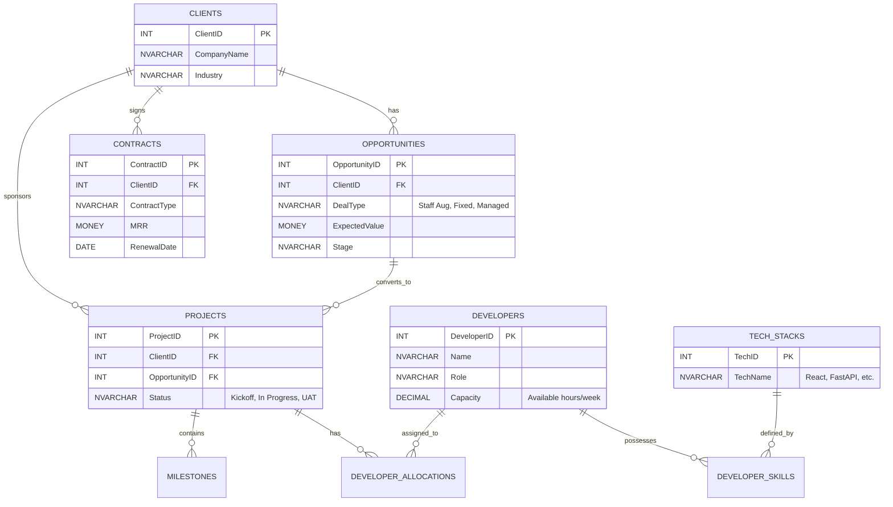

# Sanestix CRM: Architecture & Product Strategy Walkthrough

Welcome to the comprehensive project walkthrough for **Sanestix CRM**, a bespoke solution engineered explicitly for the software development lifecycle. 

## 1. Industry-Specific Module Design

Sanestix CRM is broken down into five core modules designed to seamlessly transition a lead into a delivered software project.

### Lead & Pipeline Management
* **Software-Specific Deal Types:** Pipelines are customized for *Staff Augmentation* (tracking resource requests), *Fixed-Cost Projects* (tracking scope and timeline), and *Managed Services* (tracking SLAs).
* **Estimation Integration:** Built-in tools for sales engineers to attach initial technical scopes and effort estimates (in story points or hours) directly to the opportunity.

### Resource & Skill Mapping
* **Developer Availability Matrix:** Real-time visibility into developer utilization rates.
* **Tech Stack Taxonomy:** Developers are tagged with specific skills (e.g., "Senior Python Dev", "React Expert") and proficiency levels. 
* **Capacity Forecasting:** Automatically calculates available billable hours for the upcoming sprint or quarter based on current project allocations.

### Project & Milestone Tracking
* **Sales-to-Delivery Handoff:** Once an Opportunity is marked "Closed Won", a Project is automatically instantiated with linked estimation data.
* **Agile Integration:** Features Git/Jira-style logic tracking Epics, Sprints, and Milestones.
* **Velocity vs. Forecast:** Compares actual developer velocity (story points burned) against the initial sales estimate to track profitability in real-time.

### Subscription & License Management
* **Recurring Revenue Tracking:** Manages SaaS products, maintenance contracts, and retainer agreements.
* **Renewal Alerts:** Automated workflows that notify Account Managers 60 days prior to contract expiration.
* **MRR/ARR Dashboards:** Financial reporting tailored for subscription models.

### Client Technical Portal
* **Transparency Layer:** A secure, read-only (or approval-only) view for clients.
* **Sprint Visibility:** Clients can view current sprint progress, blockages, and deployed features.
* **Document Approvals:** Dedicated space for clients to review and sign-off on technical requirements, UAT (User Acceptance Testing) documents, and architecture diagrams.

---

## 2. Database Schema (MSSQL)

Microsoft SQL Server (MSSQL) is chosen for its robust handling of complex relational transactions, excellent stored procedure support, and seamless integration with enterprise reporting tools.

### ERD Outline



### T-SQL Specific Considerations
* **Stored Procedures:** Used for complex, heavy-lifting queries like calculating `Developer Utilization Rates` across overlapping project timelines, reducing network overhead.
* **Data Types:** `MONEY` or `DECIMAL(18,4)` for high-precision billing and hourly rate calculations. `DATETIME2` for precise time-tracking of developer commits and API logs.
* **Row-Level Security (RLS):** Implemented natively in MSSQL to ensure clients accessing the portal can *only* query rows associated with their `ClientID`.

---

## 3. Backend Implementation Logic

**Technology Choice:** **Python (FastAPI)** 

**Justification:** While Node.js is excellent, FastAPI combined with **SQLAlchemy** is arguably the best choice for handling complex relational data with MSSQL. SQLAlchemy provides an incredibly mature ORM with the Unit of Work pattern, making complex, multi-table transactions (like converting an Opportunity into a Project while allocating Resources) safe and predictable. FastAPI's native Pydantic models automatically validate complex nested JSON payloads and generate Swagger documentation—perfect for the Client Technical Portal API.

### API Structure (RESTful)
* `GET /api/v1/opportunities/{id}/resources`: Fetches suggested developers based on the tech stack required for the deal.
* `POST /api/v1/projects/{id}/milestones`: Creates a new technical milestone.
* `GET /api/v1/developers/capacity?startDate=X&endDate=Y`: Returns an aggregated heatmap of developer availability.

### Authentication & Authorization Layer
* **JWT (JSON Web Tokens):** For stateless API authentication.
* **RBAC (Role-Based Access Control):** 
    * *Sales:* Can write to Leads/Opportunities, read Projects.
    * *PMs:* Can read Opportunities, write to Projects/Milestones/Resource Allocations.
    * *Developers:* Can read assigned Projects, log hours.
    * *Clients:* Restricted via specific scopes to read-only endpoints scoped to their `ClientID`.

### MSSQL Integration & Connection Strategy
* **Driver/ORM:** `pyodbc` combined with `SQLAlchemy`.
* **Connection Pooling:** SQLAlchemy's `QueuePool` handles high concurrency, preventing connection exhaustion during peak load.
* **Security:** Connection strings are NEVER hardcoded. They are injected via Environment Variables (`.env` file in dev, AWS Secrets Manager / Azure Key Vault in prod).

```python
# Example Connection String Strategy using environment variables
import os
from sqlalchemy import create_engine

DB_USER = os.getenv("DB_USER")
DB_PASS = os.getenv("DB_PASS")
DB_HOST = os.getenv("DB_HOST")
DB_NAME = os.getenv("DB_NAME")

connection_url = f"mssql+pyodbc://{DB_USER}:{DB_PASS}@{DB_HOST}/{DB_NAME}?driver=ODBC+Driver+17+for+SQL+Server"

# Connection pool setup
engine = create_engine(
    connection_url,
    pool_size=10, 
    max_overflow=20, 
    pool_pre_ping=True # Ensures dead connections are recycled
)
```

---

## 4. Frontend UX/UI (React.js)

### Dashboard Layout & Aesthetics
* **Theme:** Modern SaaS aesthetic. Dark mode by default (sleek, easy on developers' eyes) with vibrant, distinct accent colors for statuses (e.g., Neon Green for "On Track", Amber for "At Risk").
* **Layout:** A persistent collapsible sidebar for navigation. The main view is data-dense but clean, utilizing whitespace and subtle glassmorphism for floating panels.

### State Management
* **Redux Toolkit (RTK) & RTK Query:** Because Sanestix is a highly dynamic, data-driven application (live resource availability, moving Kanban cards), RTK provides predictable global state. RTK Query handles API caching, invalidation, and optimistic UI updates (e.g., immediately showing a deal moved to "Closed" before the server responds).

### Key Reusable Components
* **Data Grid:** A highly optimized table component (e.g., using AG Grid or TanStack Table) with column pinning, multi-column sorting, and complex filtering (e.g., "Show me all active projects using React AND missing a Senior Dev").
* **Pipeline Kanban:** A drag-and-drop interface for Opportunities, featuring visual indicators for "stale" deals.
* **Resource Heatmap:** A timeline view (Gantt-style) plotting developers on the Y-axis and time on the X-axis, color-coded by utilization percentage (Red = Overbooked, Green = Available).

---

## 5. Competitive Edge: Why Sanestix?

General tools like Salesforce and HubSpot are built for selling widgets or general services. They fail when the "product" being sold is human intellect and time. 

**Sanestix CRM solves the "Software House" pain points:**
1. **Closing the Sales-Delivery Gap:** In Salesforce, a won deal is the end of the line. In Sanestix, it's the beginning. The exact estimates used to win the deal instantly become the baseline metrics for the Project Management module.
2. **True Developer Velocity vs. Forecast:** General CRMs don't understand "Story Points". Sanestix links the CRM financial forecast directly to technical delivery metrics, warning management if a Fixed-Cost project is burning hours faster than anticipated.
3. **Skill-Based Resource Allocation:** You can't just assign "a person" to a React Native project; you need a React Native developer. Sanestix understands tech stacks, allowing PMs to staff projects based on actual technical requirements and available capacity, preventing the classic issue of overpromising technical capabilities during the sales cycle.
